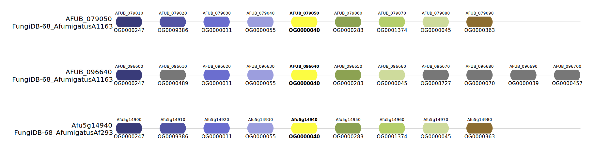

[](https://github.com/stajichlab/orthoSynAssign/actions/workflows/build_and_test.yml)
[](https://github.com/stajichlab/Phyling/actions/workflows/build_and_test.yml)
[](https://codecov.io/gh/stajichlab/orthoSynAssign)
[](https://github.com/stajichlab/orthoSynAssign/blob/main/LICENSE)
[](https://doi.org/10.5281/zenodo.18762979)

# orthoSynAssign

Ortholog Synteny Assignment Tool - A Python tool to refine orthologous groups using synteny information inferred from genome
annotation files (BED converted from GFF3/GTF). This is a Python re-implementation of the [OrthoRefine], which is written in C++
but having some issues with sample matching and memory usage. This tool is designed to be more efficient, easier to use, and more
flexible for custom analyses. We also provide a companion visualization tool, `orthosynassign-vis`, for users to verify the
results. This refined version includes improved memory management and a streamlined workflow for assigning syntenic regions,
addressing limitations identified in the original OrthoRefine implementation. Specifically, it incorporates optimized data
structures for handling genomic ranges and utilizes more efficient algorithms for finding overlaps between ortholog groups and
genomic segments. The core logic has been carefully reviewed and tested to ensure accuracy and performance, focusing on robustness
in handling large datasets.

## Usage

First, install the package following the [instruction](#install) below.

### Refine orthogroups by synteny analysis

`orthosynassign` is the main program for running the analysis. It takes the OrthoFinder-style `orthogroup.tsv` or the `N0.tsv`
under phylogenetic hierarchical orthogroups directory and output the refined orthogroups with synteny information determined using
the genome annotation files.

Most genome annotation files are made in GFF3/GTF format. However, the flexibility on the 9th attribute column makes it
challenging to correctly parse the required information and match it to entries in the orthogroup file (which usually contains
protein IDs). To make this easier, we provide a script `misc/convert_bed.sh` that converts GFF3/GTF files into BED format and uses
gene IDs as names to link with genes in the orthogroup file.

The `orthogroup.tsv` or `N0.tsv` file from OrthoFinder should be tab-separated with:

- First column: Orthogroup ID (e.g., OG0000001)
- Subsequent columns: Protein IDs for each species (column headers are species names)

In order to make it work, users need to convert the protein IDs to gene IDs before the analysis. This is typically done by
removing the transcript suffix (e.g., -T1, -T2).

Please use `orthosynassign --help` to see all available options and arguments:

```
Required arguments:
  --og_file OG_FILE     Path to OrthoFinder Orthogroups.tsv file
  --bed file [files ...]
                        Path of BED formatted genome annotation files

Options:
  -w, --window WINDOW   Controls how many total genes are considered when determining synteny for a single gene (default: 8)
  -r, --ratio_threshold THRESHOLD
                        Controls how many genes within a window must provide synteny support to classify the genes being compared as syntenous (default: 0.5)
  -o, --output OUTPUT   Output of results (default: Refined_SOGs-[YYYYMMDD-HHMMSS].tsv (UTC timestamp))
  -t, --threads THREADS
                        Number of cpus to use (default: 4)
  -v, --verbose         Enable verbose logging
  -V, --version         show program's version number and exit
  -h, --help            show this help message and exit
```

We provided some example files in directory `example`, which contains three BED annotations and a orthogroup file:

```
FungiDB-68_AfumigatusA1163.bed
FungiDB-68_AfumigatusAf293.bed
FungiDB-68_AnovofumigatusIBT16806.bed
orthogroups.tsv
```

Use the following command to run the refinement process:

```bash
orthosynassign --og_file orthogroups.tsv --bed *.bed -o Refined_SOGs.tsv
```

The refined result will output to `Refined_SOGs.tsv`.

### Visualize the refined orthogroups

`orthosynassign-vis` is a companion visualization script to verify the refined results of `orthosynassign`. It utilizes the
[pyGenomeViz] to plot the orthogroups and their synteny relationships. It takes the original, unrefined `orthogroup.tsv` file along
with the refined orthogroup file to plot a certain set of refined orthogroups using their previous orthogroup IDs as the labels
for each gene in the plot. Please use `orthosynassign-vis --help` to see all available options and arguments:

```
Required arguments:
  --og_file OG_FILE     Path to the original orthogroups.tsv file
  --sog_file SOG_FILE   Path to the refined orthogroups.tsv file
  --bed file [files ...]
                        Path of BED formatted genome annotation files
  --sog SOG [SOG ...]   Plot the SOG of the previous orthosynassign analysis

Options:
  -w, --window WINDOW   The window size applied to the previous orthosynassign analysis (default: 8)
  -o, --output OUTPUT   Output directory (default: visualize_[sog_file])
  -f, --fmt {png,jpg,svg,pdf}
                        Output image format. (default: png)
  -k, --keep_all_genes  Keep genes that are not assigned to any orthogroup
  -v, --verbose         Enable verbose logging
  -V, --version         show program's version number and exit
  -h, --help            show this help message and exit
```

The `example` directory contains another refined orthogroup file - `Refined_SOGs.tsv`, say if we want to verify one of the refined
orthogroup `SOG000032.OG0000040`:

```bash
orthosynassign-vis --og_file orthogroups.tsv --sog_file Refined_SOGs.tsv --bed *.bed --sog SOG000032.OG0000040 -f svg
```

The figure will output to `visualize_Refined_SOGs/SOG000032.OG0000040.svg`. In this figure, the genes of the observed refined
orthogroup are labelled in yellow; genes assigned to the same orthogroup within this given window are labelled in other chromatic
colors; genes with orthologs in other genomes located outside the given window are labelled in gray.



## Requirements

- Python >= 3.9, < 3.14
- [pyGenomeViz] >= 1.6.0

## Install

### From source

Clone through ssh

```bash
git clone git@github.com:stajichlab/orthoSynAssign.git
```

or https

```bash
git clone https://github.com/stajichlab/orthoSynAssign.git
```

Navigate to the project directory and install the package.

```bash
cd orthoSynAssign
pip install .
```

### For developing

Developers should clone the project directly and install the package with dev flag. Please also set up the pre-commit first before
making commit.

```bash
pip install -e ".[dev]"
pre-commit install
```

## Citation

If you use orthoSynAssign in your research, please cite:

[Cheng-Hung Tsai, & Jason Stajich. (2026). orthoSynAssign - a Python tool to refine orthogroups using synteny information [Computer software]](https://doi.org/10.5281/zenodo.18762979)

[Ludwig, J., Mrázek, J. OrthoRefine: automated enhancement of prior ortholog identification via synteny. BMC Bioinformatics 25, 163 (2024)](https://doi.org/10.1186/s12859-024-05786-7)

## Contributing

Contributions are welcome! Please feel free to submit a Pull Request.

[OrthoRefine]: https://github.com/jl02142/OrthoRefine
[pyGenomeViz]: https://github.com/moshi4/pyGenomeViz
